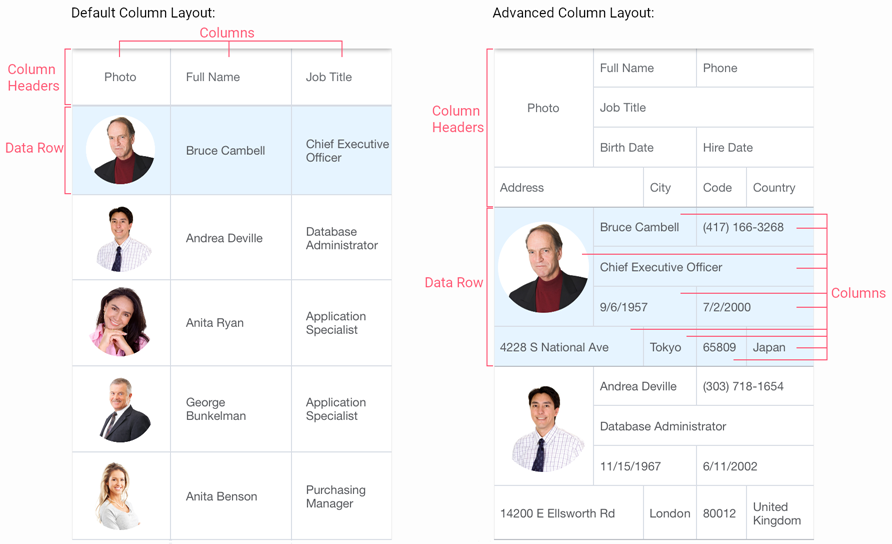

<!-- default file list -->
*Files to look at*:

* [MainPage.xaml](./DataGrid_AdvancedColumnLayout/MainPage.xaml)
* [Model.cs](./DataGrid_AdvancedColumnLayout/Model.cs)
* [ViewModel.cs](./DataGrid_AdvancedColumnLayout/ViewModel.cs)
* [MainPage.xaml.cs](./DataGrid_AdvancedColumnLayout/MainPage.xaml.cs)

<!-- default file list end -->
# Change Column Layout

This example shows how to define the multi-row column layout for a grid that contains information about *employees*. For a complete description, refer to the following help topic: [Change Column Layout](https://docs.devexpress.com/MobileControls/401696/xamarin-forms/data-grid/examples/column-layout).

To run the application:
1. [Obtain your NuGet feed URL](http://docs.devexpress.com/GeneralInformation/116042/installation/install-devexpress-controls-using-nuget-packages/obtain-your-nuget-feed-url).
2. Register the DevExpress NuGet feed as a package source.
3. Restore all NuGet packages for the solution.
