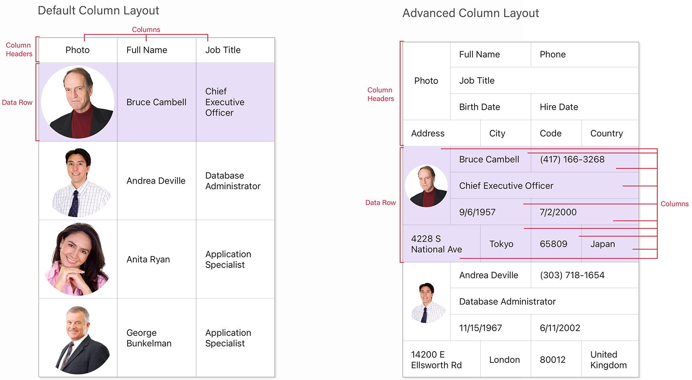

# Change Column Layout

This example shows how to define the multi-row column layout for a grid that contains information about *employees*.

<!-- default file list -->
## Files to Review

* [MainPage.xaml](./DataGrid_AdvancedColumnLayout/MainPage.xaml)
* [Model.cs](./DataGrid_AdvancedColumnLayout/Model.cs)
* [ViewModel.cs](./DataGrid_AdvancedColumnLayout/ViewModel.cs)
* [MainPage.xaml.cs](./DataGrid_AdvancedColumnLayout/MainPage.xaml.cs)

<!-- default file list end -->