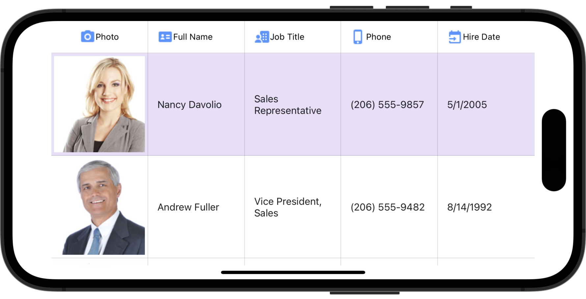

# DevExpress .NET MAUI Data Grid - Define a Column Header Template

This example shows how to define templates for grid column headers. To do this, assign a [DataTemplate](https://learn.microsoft.com/en-us/dotnet/api/microsoft.maui.controls.datatemplate) object to a column's [HeaderContentTemplate](https://docs.devexpress.com/MAUI/DevExpress.Maui.DataGrid.GridColumn.HeaderContentTemplate) property.

<!-- default file list -->
## Files to Review

* [MainPage.xaml](./DataGrid_ColumnHeaderTemplate/MainPage.xaml)
* [Model.cs](./DataGrid_ColumnHeaderTemplate/Model.cs)
* [ViewModel.cs](./DataGrid_ColumnHeaderTemplate/ViewModel.cs)
<!-- default file list end -->
