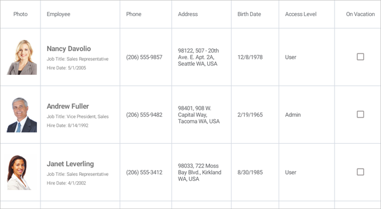

<!-- default file list -->
*Files to look at*:

* [Model.cs](./DataGrid_Columns/Model.cs)
* [ViewModel.cs](./DataGrid_Columns/ViewModel.cs)
* [MainPage.xaml](./DataGrid_Columns/MainPage.xaml)
<!-- default file list end -->
# Create Columns for Different Data Types

This example shows how to create columns in [DataGridView](https://docs.devexpress.com/MobileControls/DevExpress.XamarinForms.DataGrid.DataGridView) to display and edit data of different types. The grid is bound to a collection of *Employee* objects. Each *Employee* object contains an employee's photo (image), name, position, phone, address (strings), hire and birth dates (DateTime values), employee's access level (enumeration value), and a Boolean value indicating whether an employee is on vacation. For a complete description, refer to the following help topic: [Create Columns for Different Data Types](https://docs.devexpress.com/MobileControls/400831/xamarin-forms/data-grid/examples/all-columns).

To run the application:
1. [Obtain your NuGet feed URL](http://docs.devexpress.com/GeneralInformation/116042/installation/install-devexpress-controls-using-nuget-packages/obtain-your-nuget-feed-url).
2. Register the DevExpress NuGet feed as a package source.
3. Restore all NuGet packages for the solution.
