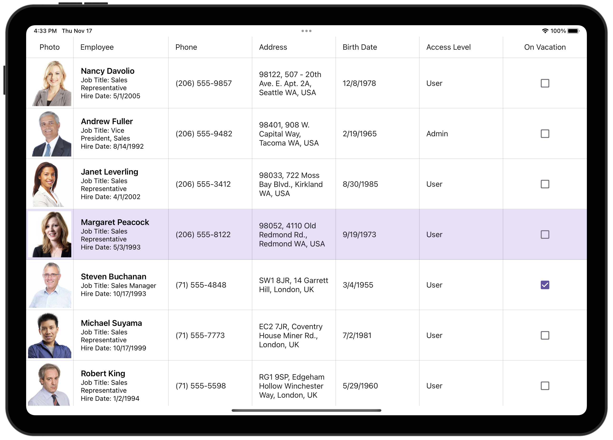

# Create Columns for Different Data Types

This example shows how to create columns in [DataGridView](https://docs.devexpress.com/MAUI/DevExpress.Maui.DataGrid.DataGridView) to display and edit data of different types. The grid is bound to a collection of *Employee* objects. Each *Employee* object contains an employee's photo (image), name, position, phone, address (strings), hire and birth dates (DateTime values), employee's access level (enumeration value), and a Boolean value indicating whether an employee is on vacation.

<!-- default file list -->
## Files to Review

* [Model.cs](./DataGrid_Columns/Model.cs)
* [ViewModel.cs](./DataGrid_Columns/ViewModel.cs)
* [MainPage.xaml](./DataGrid_Columns/MainPage.xaml)
<!-- default file list end -->
