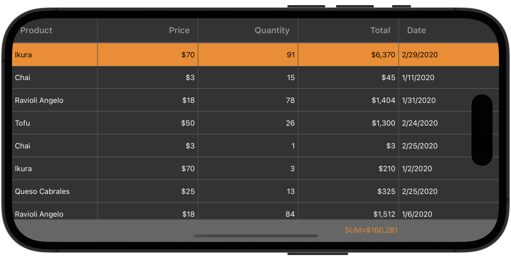

# DevExpress .NET MAUI Data Grid - Customize Appearance
This example shows how to modify the grid appearance. For a complete description, refer to the following help topic: [Change Grid Appearance](https://docs.devexpress.com/MAUI/403565/data-grid/net-maui-data-grid-appearance).

<!-- default file list -->
## Files to Review

* [MainPage.xaml](MainPage.xaml)
* [Product.cs](DataModel/Product.cs)
* [Order.cs](DataModel/Order.cs)
* [OrderRepository.cs](DataModel/OrderRepository.cs)
* [ModelObject.cs](DataModel/ModelObject.cs)
<!-- default file list end -->
