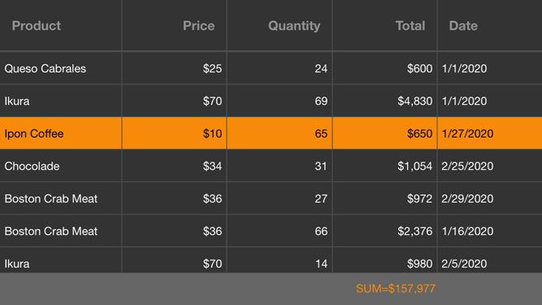

<!-- default file list -->
*Files to look at*:

* [MainPage.xaml](./DataGrid_CustomAppearance/MainPage.xaml)
* [Product.cs](./DataGrid_CustomAppearance/DataModel/Product.cs)
* [Order.cs](./DataGrid_CustomAppearance/DataModel/Order.cs)
* [OrderRepository.cs](./DataGrid_CustomAppearance/DataModel/OrderRepository.cs)
* [ModelObject.cs](./DataGrid_CustomAppearance/DataModel/ModelObject.cs)
<!-- default file list end -->
# Customize Grid Appearance
This example shows how to modify the grid appearance. For a complete description, refer to the following help topic: [Change Grid Appearance](http://docs.devexpress.devx/MobileControls/400845/xamarin-forms/data-grid/examples/grid-custom-appearance).

To run the application:
1. [Obtain your NuGet feed URL](http://docs.devexpress.com/GeneralInformation/116042/installation/install-devexpress-controls-using-nuget-packages/obtain-your-nuget-feed-url).
2. Register the DevExpress NuGet feed as a package source.
3. Restore all NuGet packages for the solution.
