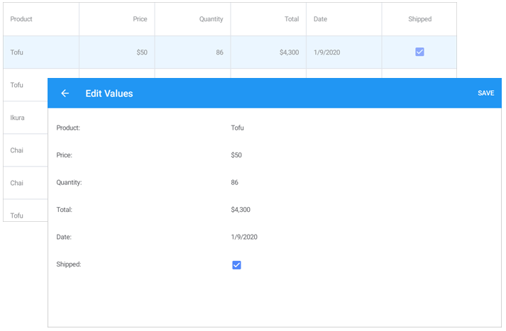

<!-- default file list -->
*Files to look at*:

* [MainPage.xaml](./DataGrid_EditForm/MainPage.xaml)
* [App.xaml.cs](./DataGrid_EditForm/App.xaml.cs)
* [Product.cs](./DataGrid_EditForm/DataModel/Product.cs)
* [Order.cs](./DataGrid_EditForm/DataModel/Order.cs)
* [OrderRepository.cs](./DataGrid_EditForm/DataModel/OrderRepository.cs)
* [ModelObject.cs](./DataGrid_EditForm/DataModel/ModelObject.cs)
<!-- default file list end -->
# Edit Cells - Edit Form
This example shows how to set up the grid to display the Edit Values form when a user taps a cell. For a complete description, refer to the following help topic: [Enable the Edit Form](https://docs.devexpress.com/MobileControls/400993/xamarin-forms/data-grid/examples/edit-cells#how-to-enable-the-edit-form).

To run the application:
1. [Obtain your NuGet feed URL](http://docs.devexpress.com/GeneralInformation/116042/installation/install-devexpress-controls-using-nuget-packages/obtain-your-nuget-feed-url).
2. Register the DevExpress NuGet feed as a package source.
3. Restore all NuGet packages for the solution.
