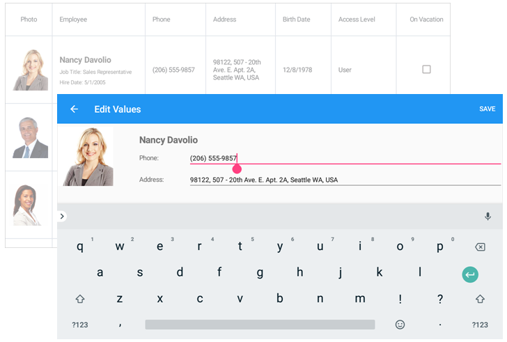

<!-- default file list -->
*Files to look at*:

* [MainPage.xaml](./DataGrid_EditFormTemplate/MainPage.xaml)
* [MainPage.xaml.cs](./DataGrid_EditFormTemplate/MainPage.xaml.cs)
* [App.xaml.cs](./DataGrid_EditFormTemplate/App.xaml.cs)
* [Model.cs](./DataGrid_EditFormTemplate/Model.cs)
* [ViewModel.cs](./DataGrid_EditFormTemplate/ViewModel.cs)
<!-- default file list end -->
# Edit Cells - Custom Edit Form
This example shows how to create a custom view for the grid's edit form and set up the grid to invoke this form when a user double taps a cell. For a complete description, refer to the following help topic: [Define a Custom Template for the Edit Form](https://docs.devexpress.com/MobileControls/400993/xamarin-forms/data-grid/examples/edit-cells#how-to-define-a-custom-template-for-the-edit-form).

To run the application:
1. [Obtain your NuGet feed URL](http://docs.devexpress.com/GeneralInformation/116042/installation/install-devexpress-controls-using-nuget-packages/obtain-your-nuget-feed-url).
2. Register the DevExpress NuGet feed as a package source.
3. Restore all NuGet packages for the solution.
