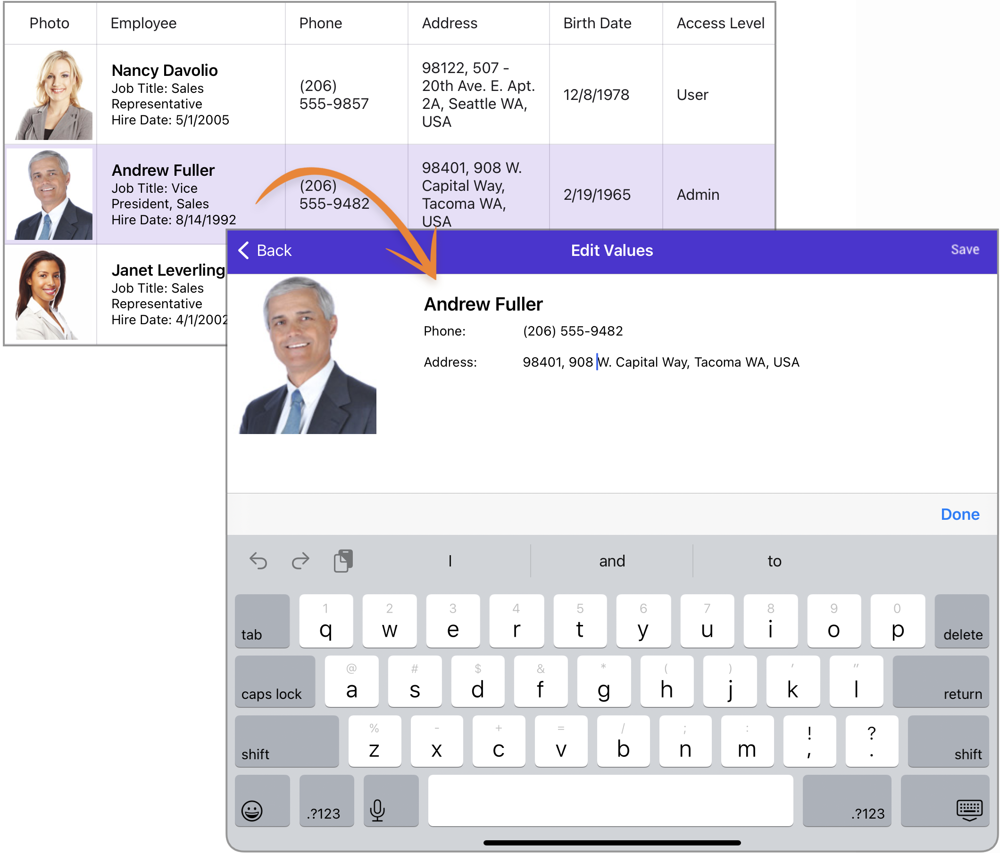

# DevExpress .NET MAUI Data Grid - Customize the Edit Form Template

This example invokes a custom cell edit form when a user double taps a cell.

Specify the [DetailEditFormTemplate](https://docs.devexpress.com/MAUI/DevExpress.Maui.DataGrid.DataGridView.DetailEditFormTemplate) property to define the custom edit form content.

To invoke the edit form on a double row tap, bind the [RowDoubleTapCommand](https://docs.devexpress.com/MAUI/DevExpress.Maui.DataGrid.DataGridView.RowDoubleTapCommand) property to the [ShowDetailEditForm](https://docs.devexpress.com/MAUI/DevExpress.Maui.DataGrid.DataGridViewCommands.ShowDetailEditForm) command.

## Files to Review

* [MainPage.xaml](MainPage.xaml)
* [MainPage.xaml.cs](MainPage.xaml.cs)

## Documentation

* [DataGridView - CRUD Operations](https://docs.devexpress.com/MAUI/404420/data-grid/crud/crud-overview)

## More Examples

* [Display the Edit Form and Validate Input Values](/CS/EditForm/)
* [Validate Values on Edit Form Closing](/CS/ValidateFormEvent/)
* [Define the In-Place Editor's Template](/CS/InPlaceEditors/)
