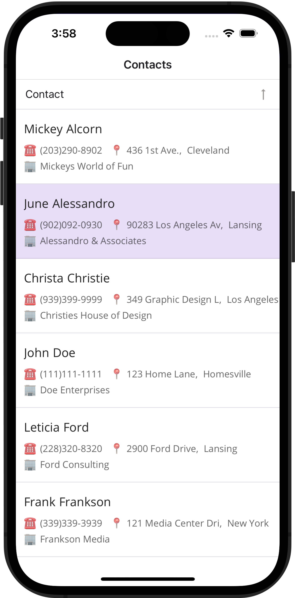

# DevExpress .NET MAUI Data Grid - Bind to a local DB (SQLite)

This example shows how to bind the DevExpress .NET MAUI DataGrid to a local db (SQLite).

This project uses the following NuGet packages to access data that are stored in the SQLite database:

* [sqlite-net-pcl](https://www.nuget.org/packages/sqlite-net-pcl/)
* [SQLite](https://www.nuget.org/packages/sqlite/)
* [SQLitePCLRaw.core](https://www.nuget.org/packages/SQLitePCLRaw.core/)
* [SQLitePCLRaw.bundle_green](https://www.nuget.org/packages/SQLitePCLRaw.bundle_green/) 

<!-- default file list -->
## Files to Review

* [Data.cs](./Model/Data.cs)
* [MainPage.xaml](./MainPage.xaml)
* [MainPage.xaml.cs](./MainPage.xaml.cs)

<!-- default file list end -->
