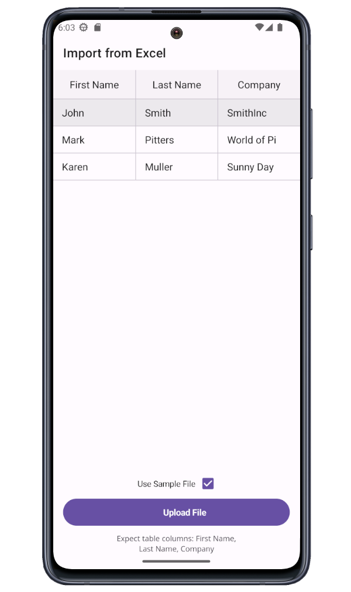

<!-- default badges list -->

[](https://supportcenter.devexpress.com/ticket/details/T1229266)
[](https://docs.devexpress.com/GeneralInformation/403183)
[](#does-this-example-address-your-development-requirementsobjectives)
<!-- default badges end -->

# DevExpress Data Grid for .NET MAUI - Import Excel Data

If you own an active DevExpress Universal or Office File API Subscription, you can use the DevExpress Office File API to import Excel data to our .NET MAUI [Data Grid](https://docs.devexpress.com/MAUI/403255/data-grid/) control. In this example, you can press the "Upload File" button to select the appropriate Excel file and display its data within the Data Grid. You can also select the "Use Sample File" option and press the button to display a predefined Excel file.



## Included Controls and Their Properties

* [DataGridView](https://docs.devexpress.com/MAUI/DevExpress.Maui.DataGrid.DataGridView): [ItemsSource](https://docs.devexpress.com/MAUI/DevExpress.Maui.DataGrid.DataGridView.ItemsSource), [Columns](https://docs.devexpress.com/MAUI/DevExpress.Maui.DataGrid.DataGridView.Columns)

* [CheckEdit](https://docs.devexpress.com/MAUI/DevExpress.Maui.Editors.CheckEdit): [IsChecked](https://docs.devexpress.com/MAUI/DevExpress.Maui.Editors.CheckEdit.IsChecked), [Label](https://docs.devexpress.com/MAUI/DevExpress.Maui.Editors.CheckEdit.Label), [CheckBoxPosition](https://docs.devexpress.com/MAUI/DevExpress.Maui.Editors.CheckEdit.CheckBoxPosition), [LabelVerticalAlignment](https://docs.devexpress.com/MAUI/DevExpress.Maui.Editors.CheckEdit.LabelVerticalAlignment), [LabelFontSize](https://docs.devexpress.com/MAUI/DevExpress.Maui.Editors.CheckEdit.LabelFontSize)

* [DXButton](https://docs.devexpress.com/MAUI/DevExpress.Maui.Core.DXButton): [Content](https://docs.devexpress.com/MAUI/DevExpress.Maui.Core.DXBorder.Content), [Icon](https://docs.devexpress.com/MAUI/DevExpress.Maui.Core.DXContentPresenter.Icon)

* [Label](https://learn.microsoft.com/en-us/dotnet/maui/user-interface/controls/label?view=net-maui-8.0): [Text](https://learn.microsoft.com/en-us/dotnet/api/microsoft.maui.controls.label.text?view=net-maui-8.0)

## Implementation Details

1. Call the [`newCustomersWorkbook.LoadDocumentAsync(filePath)`](https://docs.devexpress.com/OfficeFileAPI/DevExpress.Spreadsheet.Workbook.LoadDocumentAsync(System.String-System.Threading.CancellationToken)?p=netframework) method to open an Excel file:

    ```csharp
    private async Task LoadDataFromExcel(string filePath) {
        using Workbook newCustomersWorkbook = new Workbook();
        bool excelOpenResult = await newCustomersWorkbook.LoadDocumentAsync(filePath);
    
        if (!excelOpenResult) {
            errorHandler?.Invoke("Couldn't open the file");
            return;
        }

        // ...
    }
    ```

2. Use the [Workbook.Worksheets](https://docs.devexpress.com/OfficeFileAPI/DevExpress.Spreadsheet.Workbook.Worksheets) property to get the first sheet. To select cells with data, call the [Worksheet.GetDataRange()](https://docs.devexpress.com/OfficeFileAPI/DevExpress.Spreadsheet.Worksheet.GetDataRange?p=netframework) method:

    ```csharp
    private async Task LoadDataFromExcel(string filePath) {

        // ...

        // get the first sheet in the uploaded Excel file
        Worksheet firstWorkSheet = newCustomersWorkbook.Worksheets[0];
        // get the range of cells (TopRowIndex and LeftColumnIndex)
        CellRange valuesRange = firstWorkSheet.GetDataRange();
        int topRowIndex = valuesRange.TopRowIndex;
        int leftColumnIndex = valuesRange.LeftColumnIndex;
        // validate the received sheet and range of cells
        if (!IsValidDataStructure(firstWorkSheet, topRowIndex, leftColumnIndex)) {
            errorHandler?.Invoke("Data structure in the selected file is invalid");
            return;
        }

        // ...

    }

3. Create the `newCustomers` data object and populate it with data items imported from the Excel file:

    ```csharp
    private async Task LoadDataFromExcel(string filePath) {

        // ...

        List<Customer> newCustomers = new List<Customer>();
        for (int rowIndex = topRowIndex + 1; rowIndex < valuesRange.RowCount + topRowIndex; rowIndex++) {
            Customer newCustomer = new Customer() {
                FirstName = firstWorkSheet.Rows[rowIndex][leftColumnIndex].Value.TextValue,
                LastName = firstWorkSheet.Rows[rowIndex][leftColumnIndex + 1].Value.TextValue,
                Company = firstWorkSheet.Rows[rowIndex][leftColumnIndex + 2].Value.TextValue
            };
            newCustomers.Add(newCustomer);
        }
    
        Customers = newCustomers;
    }
    ```

## Files to Review

- [MainPage.xaml](./CS/MainPage.xaml)
- [MainPage.cs](./CS/MainPage.cs)
- [ViewModel.xaml](./CS/ViewModel.cs)

## Documentation

- [Data Grid](https://docs.devexpress.com/MAUI/403255/data-grid)
- [Button](https://docs.devexpress.com/MAUI/403983/utility-controls/index?p=netframework#button)
- [Featured Scenarios](https://docs.devexpress.com/MAUI/404291/scenarios)
- [Use Office File API in .NET MAUI Applications (macOS, iOS, Android)](https://docs.devexpress.com/OfficeFileAPI/404423/use-pdf-document-api-in-net-maui-applications?v=23.1)
- [Workbook](https://docs.devexpress.com/OfficeFileAPI/14921/spreadsheet-document-api/spreadsheet-document/workbook?p=netframework)
- [Worksheets](https://docs.devexpress.com/OfficeFileAPI/14922/spreadsheet-document-api/spreadsheet-document/worksheets?p=netframework)

## More Examples

* [DevExpress .NET MAUI Demo Center](https://github.com/DevExpress-Examples/maui-demo-app)
* [Stocks App](https://github.com/DevExpress-Examples/maui-stocks-mini)
* [Data Grid](https://github.com/DevExpress-Examples/maui-data-grid-get-started)
* [Data Form](https://github.com/DevExpress-Examples/maui-data-form-get-started)
* [Data Editors](https://github.com/DevExpress-Examples/maui-editors-get-started)
* [Charts](https://github.com/DevExpress-Examples/maui-charts)
* [Scheduler](https://github.com/DevExpress-Examples/maui-scheduler-get-started)
* [Tab Page](https://github.com/DevExpress-Examples/maui-tab-page-get-started)
* [Tab View](https://github.com/DevExpress-Examples/maui-tab-view-get-started)
* [Drawer Page](https://github.com/DevExpress-Examples/maui-drawer-page-get-started)
* [Drawer View](https://github.com/DevExpress-Examples/maui-drawer-view-get-started)
* [Collection View](https://github.com/DevExpress-Examples/maui-collection-view-get-started)
* [Popup](https://github.com/DevExpress-Examples/maui-popup-get-started)
<!-- feedback -->
## Does this example address your development requirements/objectives?

[](https://www.devexpress.com/support/examples/survey.xml?utm_source=github&utm_campaign=maui-data-grid-import-from-excel&~~~was_helpful=yes) [](https://www.devexpress.com/support/examples/survey.xml?utm_source=github&utm_campaign=maui-data-grid-import-from-excel&~~~was_helpful=no)

(you will be redirected to DevExpress.com to submit your response)
<!-- feedback end -->
