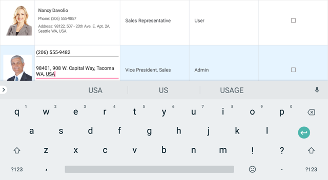

<!-- default file list -->
*Files to look at*:

* [MainPage.xaml](./DataGrid_InPlaceEditors/MainPage.xaml)
* [Model.cs](./DataGrid_InPlaceEditors/Model.cs)
* [ViewModel.cs](./DataGrid_InPlaceEditors/ViewModel.cs)

<!-- default file list end -->
# Edit Cells - In-Place Editors

This example demonstrates how to set an in-place editor template for a [TemplateColumn](https://docs.devexpress.com/MobileControls/DevExpress.XamarinForms.DataGrid.TemplateColumn)'s cell.

To run the application:
1. [Obtain your NuGet feed URL](http://docs.devexpress.com/GeneralInformation/116042/installation/install-devexpress-controls-using-nuget-packages/obtain-your-nuget-feed-url).
2. Register the DevExpress NuGet feed as a package source.
3. Restore all NuGet packages for the solution.
