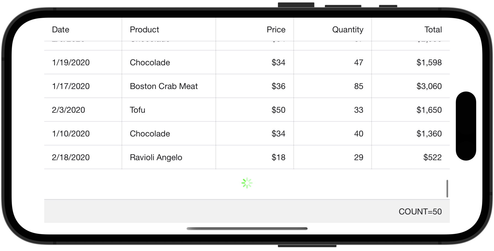

# DevExpress .NET MAUI Data Grid - Implement Load-More Functionality

This example shows how to implement the grid's load-more functionality - when a user scrolls to the bottom of the grid, a set of new data items is added to the end of the grid. Data items for each next load (ten new orders) are generated randomly in code. The maximum number of loads a user is allowed to perform is 3. The total summary displays the count of data items currently loaded to the grid (it is automatically updated after each load).

1. Set the [DataGridView.IsLoadMoreEnabled](https://docs.devexpress.com/MAUI/DevExpress.Maui.DataGrid.DataGridView.IsLoadMoreEnabled) property to **true** to enable the grid's load-more functionality.  
2. Create a command to be executed when a user scrolls to the bottom of the grid. Set the [DataGridView.IsRefreshing](https://docs.devexpress.com/MAUI/DevExpress.Maui.DataGrid.DataGridView.IsRefreshing) property to **false** after data is loaded to hide the loading indicator in the grid.  
3. Bind the [DataGridView.LoadMoreCommand](https://docs.devexpress.com/MAUI/DevExpress.Maui.DataGrid.DataGridView.LoadMoreCommand) property to the created command.  

<!-- default file list -->
## Files to Review

* [Order.cs](./DataGridView_LoadMore/DataModel/Order.cs)
* [Product.cs](./DataGridView_LoadMore/DataModel/Product.cs)
* [OrderRepository.cs](./DataGridView_LoadMore/DataModel/OrderRepository.cs)
* [ViewModel.cs](./DataGridView_LoadMore/DataModel/ViewModel.cs)
* [MainPage.xaml](./DataGridView_LoadMore/MainPage.xaml)
<!-- default file list end -->
