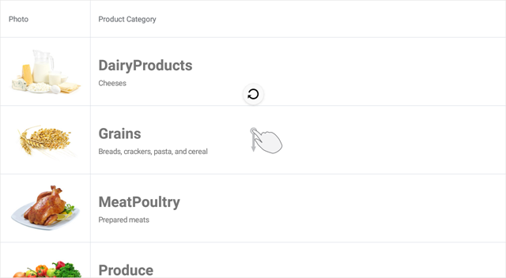

# DevExpress .NET MAUI Data Grid - Implement Pull-to-Refresh

This example shows how to set up the grid so that it allows users to request a content update with the pull-down gesture. To do this, follow the steps below.

1. Set the [DataGridView.IsPullToRefreshEnabled](https://docs.devexpress.com/MAUI/DevExpress.Maui.DataGrid.DataGridView.IsPullToRefreshEnabled) property to **true** to enable the grid's pull-to-refresh functionality.  
2. Create a command to be executed when a user pulls the grid down. Set the [DataGridView.IsRefreshing](https://docs.devexpress.com/MAUI/DevExpress.Maui.DataGrid.DataGridView.IsRefreshing) property to **false** after data is refreshed to hide the refresh indicator in the grid.  
3. Bind the [DataGridView.PullToRefreshCommand](https://docs.devexpress.com/MAUI/DevExpress.Maui.DataGrid.DataGridView.PullToRefreshCommand) property to the created command.  

<!-- default file list -->
## Files to Review

* [Model.cs](./DataGridView_PullToRefresh/Model.cs)
* [ViewModel.cs](./DataGridView_PullToRefresh/ViewModel.cs)
* [MainPage.xaml](./DataGridView_PullToRefresh/MainPage.xaml)
<!-- default file list end -->
