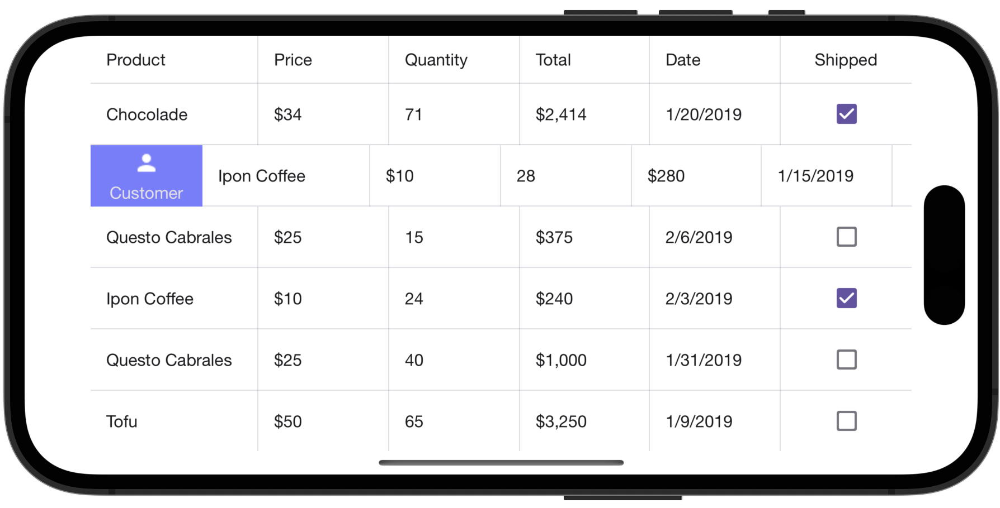
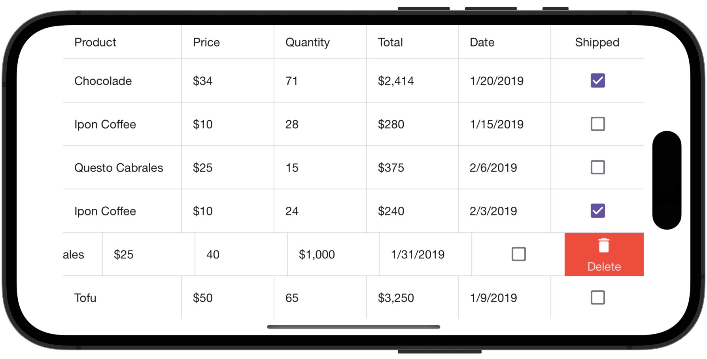

<!-- default file list -->
*Files to look at*:

* [Customer.cs](./DataGridView_Swipe/DataModel/Customer.cs)
* [Product.cs](./DataGridView_Swipe/DataModel/Product.cs)
* [Order.cs](./DataGridView_Swipe/DataModel/Order.cs)
* [OrderRepository.cs](./DataGridView_Swipe/DataModel/OrderRepository.cs)
* [MainPage.xaml](./DataGridView_Swipe/MainPage.xaml)
<!-- default file list end -->
# Define Swipe Actions for Data Rows

This example shows how to extend the grid’s UI with additional elements (buttons) that appear when a user swipes a data row (from left to right or from right to left) and perform custom actions on tap. It defines two swipe actions for rows of the grid bound to the collection of orders:  
- Display information on a customer - When a user swipes a data row from left to right, the **Customer** button appears on the left side of the row.  
  
- Remove an order - When a user swipes a data row from right to left, the **Delete** button appears on the right side of the row.  
  

For a complete description, refer to the following help topic: [Define Swipe Actions for Data Rows](https://docs.devexpress.com/MobileControls/401053/xamarin-forms/data-grid/examples/swipe-actions).

To run the application:
1. [Obtain your NuGet feed URL](http://docs.devexpress.com/GeneralInformation/116042/installation/install-devexpress-controls-using-nuget-packages/obtain-your-nuget-feed-url).
2. Register the DevExpress NuGet feed as a package source.
3. Restore all NuGet packages for the solution.
