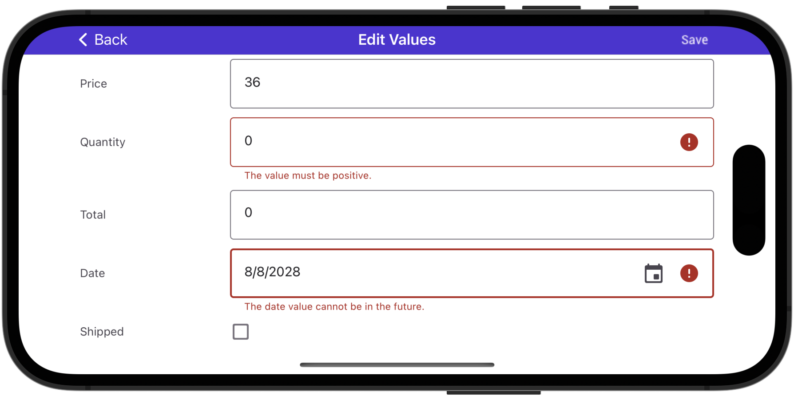

<!-- default file list -->
*Files to look at*:

* [MainPage.xaml](./DataGrid_ValidateCellEvent/MainPage.xaml)
* [MainPage.xaml.cs](./DataGrid_ValidateCellEvent/MainPage.xaml.cs)
* [App.xaml.cs](./DataGrid_ValidateCellEvent/App.xaml.cs)
* [Product.cs](./DataGrid_ValidateCellEvent/DataModel/Product.cs)
* [Order.cs](./DataGrid_ValidateCellEvent/DataModel/Order.cs)
* [OrderRepository.cs](./DataGrid_ValidateCellEvent/DataModel/OrderRepository.cs)
* [ModelObject.cs](./DataGrid_ValidateCellEvent/DataModel/ModelObject.cs)
<!-- default file list end -->
# Validate a Value Once It Is Entered
This example shows how to validate cell values that users enter in the edit form. Use the [EditFormPage.ValidateCell](https://docs.devexpress.com/MobileControls/DevExpress.XamarinForms.DataGrid.EditFormPage.ValidateCell) event that occurs after a user changes a cell value in the [default edit form](https://docs.devexpress.com/MobileControls/400993/xamarin-forms/data-grid/examples/edit-cells#how-to-enable-the-edit-form) and moves focus from the editor. For a complete description, refer to the following help topic: [Validate Data Input](https://docs.devexpress.com/MobileControls/401328/xamarin-forms/data-grid/examples/input-validation#validate-a-value-once-it-is-entered).

To run the application:
1. [Obtain your NuGet feed URL](http://docs.devexpress.com/GeneralInformation/116042/installation/install-devexpress-controls-using-nuget-packages/obtain-your-nuget-feed-url).
2. Register the DevExpress NuGet feed as a package source.
3. Restore all NuGet packages for the solution.
