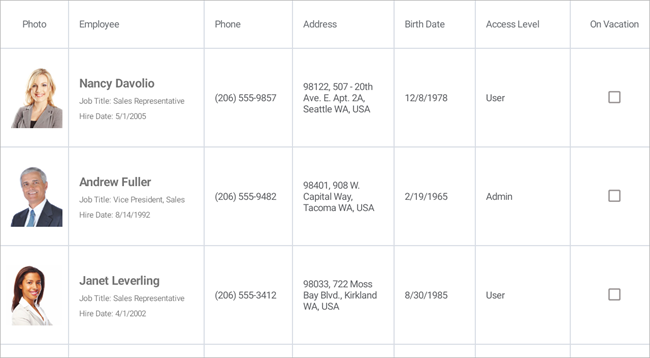

<!-- default badges list -->

[](https://supportcenter.devexpress.com/ticket/details/T1011038)
[](https://docs.devexpress.com/GeneralInformation/403183)
<!-- default badges end -->
# DevExpress Data Grid for .NET MAUI

[DevExpress Mobile UI](https://www.devexpress.com/maui/) allows you to use a .NET cross-platform UI toolkit and C# to build native apps for iOS and Android.


The **DevExpress Mobile UI for Xamarin.Forms and .NET MAUI** is free of charge. To learn more about our offer and to reserve your copy, visit [Free DevExpress Mobile UI for Xamarin.Forms and .NET MAUI](https://www.devexpress.com/xamarin-free).

## Requirements

Please register the DevExpress NuGet Gallery in Visual Studio to restore the NuGet packages used in this solution. See the following topic for more information: [Get Started with DevExpress Mobile UI for .NET MAUI](https://docs.devexpress.com/MAUI/403249/get-started).

## Documentation

- [Data Grid](https://docs.devexpress.com/MAUI/403255/data-grid/data-grid)
- [Charts](https://docs.devexpress.com/MAUI/403300/charts/charts)
- [Data Form](https://docs.devexpress.com/MAUI/403640/data-form)
- [Navigation](https://docs.devexpress.com/MAUI/403297/navigation/index)
- [Data Editors](https://docs.devexpress.com/MAUI/403427/editors/index)
- [Collection View](https://docs.devexpress.com/MAUI/403324/collection-view/index)

## More Examples

* [Stocks App](https://github.com/DevExpress-Examples/maui-stocks-mini)
* [Data Form](https://github.com/DevExpress-Examples/maui-data-form-get-started)
* [Data Editors](https://github.com/DevExpress-Examples/maui-editors-get-started)
* [Pie Chart](https://github.com/DevExpress-Examples/maui-pie-chart-get-started)
* [Scatter Chart](https://github.com/DevExpress-Examples/maui-scatter-chart-get-started)
* [Tab View](https://github.com/DevExpress-Examples/maui-tab-view-get-started)
* [Collection View](https://github.com/DevExpress-Examples/maui-collection-view-get-started)

## What's in This Repository

The DevExpress Data Grid for .NET MAUI is a data-aware control designed to present and manage data in a tabular format.



This example allows you to get started with the DataGridView component - bind it to a data source and configure its columns.

### Files to Look At

<!-- default file list -->
* [MauiProgram.cs](./CS/DataGridExample/MauiProgram.cs)
* [MainPage.xaml](./CS/DataGridExample/MainPage.xaml)
* [Model.cs](./CS/DataGridExample/Model.cs)
* [ViewModel.cs](./CS/DataGridExample/ViewModel.cs)
<!-- default file list end -->

## How to Run This Application

1. Install a [.NET MAUI development](https://docs.microsoft.com/en-gb/dotnet/maui/get-started/installation) environment and open the solution in Visual Studio 2022.
2. Register the following NuGet feed in Visual Studio: `https://nuget.devexpress.com/free/api`.  
	If you are an active DevExpress [Universal](https://www.devexpress.com/subscriptions/universal.xml) customer or have registered our [free Xamarin UI controls](https://www.devexpress.com/xamarin/), this MAUI preview will be available in your personal NuGet feed automatically.
3. Restore NuGet packages.  
4. Run the application on an iOS or Android emulator.  

## How to Reproduce This Application

The following step-by-step tutorial details how to reproduce this application.

### Create a New MAUI Application and Add a Data Grid

Create a new .NET MAUI solution in Visual Studio 22 Preview. Refer to the following Microsoft documentation for more information on how to get started with .NET MAUI: [.NET Multi-platform App UI](https://docs.microsoft.com/en-gb/dotnet/maui/).

Register `https://nuget.devexpress.com/free/api` as a package source in Visual Studio, if you are not an active DevExpress [Universal](https://www.devexpress.com/subscriptions/universal.xml) customer or have not yet registered our [free Xamarin UI controls](https://www.devexpress.com/xamarin/).

Install the **DevExpress.Maui.DataGrid** package from your NuGet feed.

In the *MauiProgram.cs* file, call the **UseDevExpress** method to register handlers for all DevExpress controls:

```cs
using Microsoft.Maui;
using Microsoft.Maui.Controls.Hosting;
using Microsoft.Maui.Hosting;
using DevExpress.Maui;

namespace DataGridExample {
    public static class MauiProgram {
        public static MauiApp CreateMauiApp() {
            var builder = MauiApp.CreateBuilder();
            builder
                .UseMauiApp<App>()
                .UseDevExpress()
                .ConfigureFonts(fonts => {
                    fonts.AddFont("OpenSans-Regular.ttf", "OpenSansRegular");
                });
            return builder.Build();
        }
    }
}
```

In the *MainPage.xaml* file, use the *dxg* prefix to declare the **DevExpress.Maui.DataGrid** namespace and add a [DataGridView](http://docs.devexpress.devx/MAUI/DevExpress.Maui.DataGrid.DataGridView) object to the ContentPage:

```xaml
<ContentPage xmlns="http://schemas.microsoft.com/dotnet/2021/maui"
             xmlns:x="http://schemas.microsoft.com/winfx/2009/xaml"
             x:Class="DataGridExample.MainPage"
             xmlns:dxg="clr-namespace:DevExpress.Maui.DataGrid;assembly=DevExpress.Maui.DataGrid">
    <dxg:DataGridView>
    </dxg:DataGridView>
</ContentPage>
```

### Create a Data Source
In this example, the grid is bound to a collection of *Employee* objects - *EmployeeData*. Create a *Model.cs* file with the following classes:

```cs
using System.Collections.ObjectModel;
using Microsoft.Maui.Controls;
using System;

namespace DataGridExample {
    public enum AccessLevel {
        Admin,
        User
    }

    public class Employee {
        string name;

        public string Name {
            get { return name; }
            set {
                name = value;
                if (Photo == null && !String.IsNullOrEmpty(name)) 
                    Photo = ImageSource.FromFile(name.ToLower().Replace(" ", "_") + ".jpg");
            }
        }

        public Employee(string name) {
            this.Name = name;
        }
        public ImageSource Photo { get; set; }
        public DateTime BirthDate { get; set; }
        public DateTime HireDate { get; set; }
        public string Position { get; set; }
        public string Address { get; set; }
        public string Phone { get; set; }
        public AccessLevel Access { get; set; }
        public bool OnVacation { get; set; }
    }

    public class EmployeeData {
        void GenerateEmployees() {
            ObservableCollection<Employee> result = new ObservableCollection<Employee>();
            result.Add(
                new Employee("Nancy Davolio") {
                    BirthDate = new DateTime(1978, 12, 8),
                    HireDate = new DateTime(2005, 5, 1),
                    Position = "Sales Representative",
                    Address = "98122, 507 - 20th Ave. E. Apt. 2A, Seattle WA, USA",
                    Phone = "(206) 555-9857",
                    Access = AccessLevel.User,
                    OnVacation = false
                }
            );
            result.Add(
                new Employee("Andrew Fuller") {
                    BirthDate = new DateTime(1965, 2, 19),
                    HireDate = new DateTime(1992, 8, 14),
                    Position = "Vice President, Sales",
                    Address = "98401, 908 W. Capital Way, Tacoma WA, USA",
                    Phone = "(206) 555-9482",
                    Access = AccessLevel.Admin,
                    OnVacation = false
                }
            );
            result.Add(
                new Employee("Janet Leverling") {
                    BirthDate = new DateTime(1985, 8, 30),
                    HireDate = new DateTime(2002, 4, 1),
                    Position = "Sales Representative",
                    Address = "98033, 722 Moss Bay Blvd., Kirkland WA, USA",
                    Phone = "(206) 555-3412",
                    Access = AccessLevel.User,
                    OnVacation = false
                }
            );
            result.Add(
                new Employee("Margaret Peacock") {
                    BirthDate = new DateTime(1973, 9, 19),
                    HireDate = new DateTime(1993, 5, 3),
                    Position = "Sales Representative",
                    Address = "98052, 4110 Old Redmond Rd., Redmond WA, USA",
                    Phone = "(206) 555-8122",
                    Access = AccessLevel.User,
                    OnVacation = false
                }
            );
            result.Add(
                new Employee("Steven Buchanan") {
                    BirthDate = new DateTime(1955, 3, 4),
                    HireDate = new DateTime(1993, 10, 17),
                    Position = "Sales Manager",
                    Address = "SW1 8JR, 14 Garrett Hill, London, UK",
                    Phone = "(71) 555-4848",
                    Access = AccessLevel.User,
                    OnVacation = true
                }
            );
            result.Add(
                new Employee("Michael Suyama") {
                    BirthDate = new DateTime(1981, 7, 2),
                    HireDate = new DateTime(1999, 10, 17),
                    Position = "Sales Representative",
                    Address = "EC2 7JR, Coventry House Miner Rd., London, UK",
                    Phone = "(71) 555-7773",
                    Access = AccessLevel.User,
                    OnVacation = false
                }
            );
            result.Add(
                new Employee("Robert King") {
                    BirthDate = new DateTime(1960, 5, 29),
                    HireDate = new DateTime(1994, 1, 2),
                    Position = "Sales Representative",
                    Address = "RG1 9SP, Edgeham Hollow Winchester Way, London, UK",
                    Phone = "(71) 555-5598",
                    Access = AccessLevel.User,
                    OnVacation = false
                }
            );
            result.Add(
                new Employee("Laura Callahan") {
                    BirthDate = new DateTime(1985, 1, 9),
                    HireDate = new DateTime(2004, 3, 5),
                    Position = "Inside Sales Coordinator",
                    Address = "98105, 4726 - 11th Ave. N.E., Seattle WA, USA",
                    Phone = "(206) 555-1189",
                    Access = AccessLevel.User,
                    OnVacation = true
                }
            );
            result.Add(
                new Employee("Anne Dodsworth") {
                    BirthDate = new DateTime(1980, 1, 27),
                    HireDate = new DateTime(2004, 11, 15),
                    Position = "Sales Representative",
                    Address = "WG2 7LT, 7 Houndstooth Rd., London, UK",
                    Phone = "(71) 555-4444",
                    Access = AccessLevel.User,
                    OnVacation = false
                }
            );
            Employees = result;
        }

        public ObservableCollection<Employee> Employees { get; private set; }

        public EmployeeData() {
            GenerateEmployees();
        }
    }
}
```

Create a *ViewModel.cs* file and add a view model class: 

```cs
using System.Collections.Generic;
using System.ComponentModel;

namespace DataGridExample {
    public class EmployeeDataViewModel : INotifyPropertyChanged {
        readonly EmployeeData data;

        public event PropertyChangedEventHandler PropertyChanged;
        public IReadOnlyList<Employee> Employees { get => data.Employees; }

        public EmployeeDataViewModel() {
            data = new EmployeeData();
        }

        protected void RaisePropertyChanged(string name) {
            if (PropertyChanged != null)
                PropertyChanged(this, new PropertyChangedEventArgs(name));
        }
    }
}
```

### Bind the Grid to Data
In the *MainPage.xaml* file:
1. Assign an **EmployeeDataViewModel** object to the **ContentPage.BindingContext** property.
2. Bind the [DataGridView.ItemsSource](http://docs.devexpress.com/MAUI/DevExpress.Maui.DataGrid.DataGridView.ItemsSource) property to the employee collection object that the **EmployeeDataViewModel.Employees** property returns.

```xaml
<ContentPage xmlns="http://schemas.microsoft.com/dotnet/2021/maui"
             xmlns:x="http://schemas.microsoft.com/winfx/2009/xaml"
             x:Class="DataGridExample.MainPage"
             xmlns:dxg="clr-namespace:DevExpress.Maui.DataGrid;assembly=DevExpress.Maui.DataGrid"
             xmlns:local="clr-namespace:DataGridExample">
    <ContentPage.BindingContext>
        <local:EmployeeDataViewModel/>
    </ContentPage.BindingContext>
    <dxg:DataGridView ItemsSource="{Binding Employees}">
    </dxg:DataGridView>
</ContentPage>
```

### Specify Grid Columns

Do the following to specify a collection of grid columns:
1. Create column objects and use the [FieldName](http://docs.devexpress.com/MAUI/DevExpress.Maui.DataGrid.GridColumn.FieldName) property to bind each column to a data source field.
2. Add columns to the [DataGridView.Columns](http://docs.devexpress.com/MAUI/DevExpress.Maui.DataGrid.DataGridView.Columns) collection in the order you want them to be displayed in the grid.

In this example, the grid contains the following columns:

- **Photo** ([ImageColumn](http://docs.devexpress.com/MAUI/DevExpress.Maui.DataGrid.ImageColumn)) - displays photos of employees. Add images to a project as embedded resources.

- **Employee** ([TemplateColumn](http://docs.devexpress.com/MAUI/DevExpress.Maui.DataGrid.TemplateColumn)) - displays names, positions, and hire dates of employees. 

    Assign a template to the **TemplateColumn.DisplayTemplate** property to define the appearance of column cells. Each cell contains a *Microsoft.Maui.Controls.Grid* with three *Microsoft.Maui.Controls.Label* elements bound to the *Name*, *Position*, and *HireDate* properties of the *Employee* class.
    
    The **CellData** object specifies a binding context for a cell template. Its **CellData.Value** property returns a value of a data field assigned to the column’s **FieldName** property. In this example, a column cell displays not only this field value but also the values of two more fields. Use the **CellData.Item** property to access the whole data row object (*Employee*) and bind its properties to properties of labels defined in the template.

- **Phone** and **Address** ([TextColumn](http://docs.devexpress.com/MAUI/DevExpress.Maui.DataGrid.TextColumn)) - display phones and addresses of employees. The keyboard for text input appears when a user activates a cell to edit an employee’s phone or address.  

- **Birth Date** ([DateColumn](http://docs.devexpress.com/MAUI/DevExpress.Maui.DataGrid.DateColumn)) -  displays birth days of employees and allows users to edit dates.  

- **Access Level** ([ComboBoxColumn](http://docs.devexpress.com/MAUI/DevExpress.Maui.DataGrid.ComboBoxColumn)) - displays employee access level and allows a user to select between predefined values (*Admin* or *User*) to change a cell value.  

- **On Vacation** ([CheckBoxColumn](http://docs.devexpress.com/MAUI/DevExpress.Maui.DataGrid.CheckBoxColumn)) - specifies whether an employee is on leave. This column displays checkboxes in cells to display and manage Boolean values.

Use the [DataGridView.EditorShowMode](http://docs.devexpress.com/MAUI/DevExpress.Maui.DataGrid.DataGridView.EditorShowMode) property to specify a gesture that invokes an in-place editor for a cell. 
The grid automatically defines an editor type depending on the type of a column to which a cell belongs (except for [TemplateColumn](http://docs.devexpress.com/MAUI/DevExpress.Maui.DataGrid.TemplateColumn)).
    
```xaml
<dxg:DataGridView ItemsSource="{Binding Employees}"
                  EditorShowMode="DoubleTap">
    <dxg:DataGridView.Columns>
        <dxg:TemplateColumn FieldName="Photo" Width="100">
            <dxg:TemplateColumn.DisplayTemplate>
                <DataTemplate>
                    <Image Source="{Binding Item.Photo}" Margin="3"/>
                </DataTemplate>
            </dxg:TemplateColumn.DisplayTemplate>
        </dxg:TemplateColumn>
        <dxg:TemplateColumn FieldName="Name" Caption="Employee" MinWidth="200">
            <dxg:TemplateColumn.DisplayTemplate>
                <DataTemplate>
                    <Grid VerticalOptions="Center" Padding="15, 0, 0, 0" RowDefinitions="Auto, Auto, Auto">
                        <Label Text="{Binding Item.Name}" FontSize="18" FontAttributes="Bold"
                            TextColor="{DynamicResource GridCellFontColor}" Grid.Row="0" />
                        <Label Text="{Binding Item.Position, StringFormat = 'Job Title: {0}'}"
                            FontSize="Small" TextColor="{DynamicResource GridCellFontColor}" 
                            Grid.Row="1"/>
                        <Label Text="{Binding Item.HireDate, StringFormat = 'Hire Date: {0:d}'}"
                            FontSize="Small" TextColor="{DynamicResource GridCellFontColor}" 
                            Grid.Row="2" />
                    </Grid>
                </DataTemplate>
            </dxg:TemplateColumn.DisplayTemplate>
        </dxg:TemplateColumn>
        <dxg:TextColumn FieldName="Phone" 
                        MinWidth="130" VerticalContentAlignment="Center" />
        <dxg:TextColumn FieldName="Address" 
                        MinWidth="150" VerticalContentAlignment="Center" />
        <dxg:DateColumn FieldName="BirthDate" 
                        MinWidth="120" DisplayFormat="d" VerticalContentAlignment="Center"/>
        <dxg:ComboBoxColumn FieldName="Access" Caption="Access Level" 
                            MinWidth="140" VerticalContentAlignment="Center"/>
        <dxg:CheckBoxColumn FieldName="OnVacation" 
                            MinWidth="130" VerticalContentAlignment="Center"/>
    </dxg:DataGridView.Columns>
</dxg:DataGridView>
```

### Enable Drag-and-Drop
The DataGridView supports drag-and-drop operations and allows users to reorder rows. Users should touch and hold a data row and then drag and drop the row to another position.

To enable drag-and-drop operations, set the [AllowDragDropRows](http://docs.devexpress.com/MAUI/DevExpress.Maui.DataGrid.DataGridView.AllowDragDropRows) property to **True**.
```xaml
<dxg:DataGridView ItemsSource="{Binding Employees}" EditorShowMode="DoubleTap" AllowDragDropRows="True"/>
```
