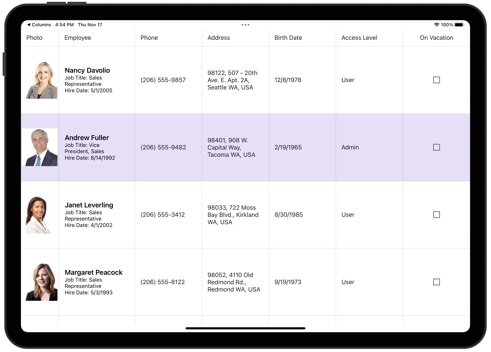

<!-- default badges list -->

<!-- default badges end -->
# DevExpress Data Grid for .NET MAUI

[DevExpress Mobile UI](https://www.devexpress.com/maui/) allows you to use a .NET cross-platform UI toolkit and C# to build native apps for iOS and Android.

The **DevExpress Mobile UI for Xamarin.Forms and .NET MAUI** is free of charge. To learn more about our offer and get your copy, visit [Free DevExpress Mobile UI for Xamarin.Forms and .NET MAUI](https://www.devexpress.com/xamarin-free).

## Requirements

Please register the DevExpress NuGet Gallery in Visual Studio to restore the NuGet packages used in this solution. See the following topic for more information: [Get Started with DevExpress Mobile UI for .NET MAUI](https://docs.devexpress.com/MAUI/403249/get-started).

You can also refer to the following YouTube video for more information on how to get started with the DevExpress .NET MAUI Controls: [Setting up a .NET MAUI Project](https://www.youtube.com/watch?v=juJvl5UicIQ).

## What's in This Repository

The DevExpress Data Grid for .NET MAUI is a data-aware control designed to present and manage data in a tabular format.

The [Get Started with the DevExpress Data Grid for .NET MAUI](/CS/DataGridExample/) example allows you to get started with the DataGridView component - bind it to a data source and configure its columns.

Refer to the following YouTube video for instructions on how to get started with the DevExpress Data Grid for .NET MAUI: [Adding Data Grid to your .NET MAUI application](https://www.youtube.com/watch?v=HVfDmzLKq-0).

### Task-Based Examples

This repository contains projects that allow you to achieve the following tasks:

#### Binding to Data

* [Get Started with the DevExpress Data Grid for .NET MAUI](/CS/DataGridExample/)
* [Create Columns for Different Data Types](/CS/Columns/)
* [Bind to a Local Database (SQLite)](/CS/GridDatafromSQLite/)
* [Bind to a Custom WebAPI Server (ASP.NET Core)](/CS/ASPDataBaseServer/)
* [Bind to a Serverless DB (Firebase)](/CS/GridDatafromFireBase/)

#### Edit and Validate Data

* [Display the Edit Form and Validate Input Values](/CS/EditForm/)
* [Define the In-Place Editor's Template](/CS/InPlaceEditors/)
* [Validate Values on Edit Form Closing](/CS/ValidateFormEvent/)
* [Validate New Values in In-Place Cell Editors](/CS/ValidateInPlaceEditors/)

#### Customize Appearance 

* [Customize a Data Grid Appearance](/CS/CustomAppearance/)
* [Display the Multi-Row Column Layout](/CS/AdvancedColumnLayout/)
* [Define a Column Header Template](/CS/ColumnHeaderTemplate/)
* [Customize the Edit Form Template](/CS/EditFormTemplate/)

#### End-User Interaction

* [Implement Load-More Functionality](/CS/LoadMore/)
* [Implement Pull-to-Refresh](/CS/PullToRefresh/)
* [Define Swipe Actions for Data Rows](/CS/Swipe/)
* [Implement a Column Chooser](/CS/ColumnChooser/)
* [Drag and Drop - Replicate a Single-Column Kanban View](/CS/SingleColumnKanbanView/)
* [Implement Search Bar](/CS/SearchBar/)
* [Export DataGrid Data](/CS/ExportGridData/)

## Documentation

- [Data Grid](https://docs.devexpress.com/MAUI/403255/data-grid/data-grid)

## More Examples
* [Stocks App](https://github.com/DevExpress-Examples/maui-stocks-mini)
* [Data Form](https://github.com/DevExpress-Examples/maui-data-form-get-started)
* [Data Editors](https://github.com/DevExpress-Examples/maui-editors-get-started)
* [Charts](https://github.com/DevExpress-Examples/maui-charts)
* [Scheduler](https://github.com/DevExpress-Examples/maui-scheduler-get-started)
* [Tab Page](https://github.com/DevExpress-Examples/maui-tab-page-get-started)
* [Tab View](https://github.com/DevExpress-Examples/maui-tab-view-get-started)
* [Drawer Page](https://github.com/DevExpress-Examples/maui-drawer-page-get-started)
* [Drawer View](https://github.com/DevExpress-Examples/maui-drawer-view-get-started)
* [Collection View](https://github.com/DevExpress-Examples/maui-collection-view-get-started)
* [Popup](https://github.com/DevExpress-Examples/maui-popup-get-started)
<!-- feedback -->
## Does this example address your development requirements/objectives?

 

(you will be redirected to DevExpress.com to submit your response)
<!-- feedback end -->
